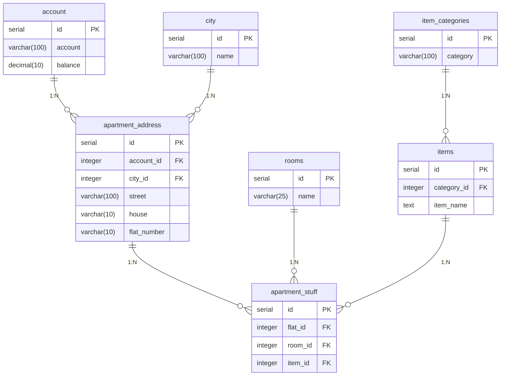

# Проект обстановки квартиры

### Технологии

для визуализации схем в readme.md нужно установить плагин mermaid

- Java
- Docker
- Postgres

### Docker

#### запуск в контейнере необходимой версии PostgreSQL, переопределение суперпользователя и создание базы данных с нужным именем

```
docker run --name appart-pg-17.2 -p 5433:5432 -e POSTGRES_USER=postgres -e POSTGRES_PASSWORD=postgres -e POSTGRES_DB=apartment -d postgres:17.2
```

```
docker compose up -d
```

Инициализацию БД можно запустить через однострочник, но в этом случае требуется указывать абсолютный путь до каталога со
скриптами:

```
docker run --name appart-pg-17.2 -p 5433:5432 -e POSTGRES_USER=postgres -e POSTGRES_PASSWORD=postgres -e POSTGRES_DB=apartment  -d -v "/absolute/path/to/directory-with-init-scripts":/docker-entrypoint-initdb.d postgres:17.2
```

```
psql -U postgres -d apartment
```

### Скрипт удаляет всё контейнеры, образы, тома, сети одной командой

```
./clean-docker.sh
```

### Скрипт автоматизирует очистку и перезапуск Docker Compose ( Остановка и удаление контейнеров, сетей и томов и "висячих" образов)

```
./restart-docker-compose.sh
```

Связи:

city ||--o{ apartment_address: Один город может иметь много адресов квартир (связь "один ко многим").

item_categories ||--o{ items: Одна категория может содержать много товаров (связь "один ко многим").

